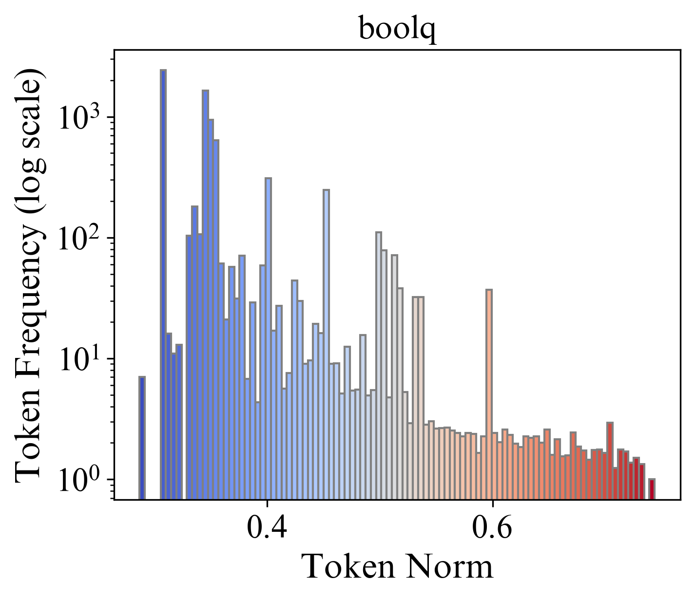

## Hyperbolic Low-rank Fine-tuning for LLMs

### 1.Introduction
   Large language models (LLMs) have demonstrated remarkable performance on various tasks. However, it remains an open question whether the default Euclidean space is the most suitable choice for embedding tokens in LLMs. In this study, we first investigate the non-Euclidean characteristics of LLMs. 
   Our findings reveal that token frequency follows a power-law distribution, with high-frequency tokens clustering near the origin and low-frequency tokens positioned farther away. Additionally, token embeddings exhibit a high degree of hyperbolicity, indicating a latent tree-like structure in the embedding space. Building on the observation, we propose to efficiently fine-tune LLMs in hyperbolic space to better exploit the underlying complex structures.  However, we found that this fine-tuning in hyperbolic space cannot be achieved with naive application of exponential and logarithmic maps, when the embedding and weight matrices both reside in Euclidean space.
   To address this technique issue, we introduce a new method called hyperbolic low-rank efficient fine-tuning, HypLoRA, that performs low-rank adaptation directly on the hyperbolic manifold, avoiding the cancellation effect caused by the exponential and logarithmic maps, thus preserving the hyperbolic modeling capabilities. Through extensive experiments, we demonstrate that HypLoRA significantly enhances the performance of LLMs on reasoning tasks, particularly for complex reasoning problems. 

### 2.Power-law Distribution in Token Embedding

|   |   |   |
|:----------------------------------------------------------------------------------------------------:|:--------------------------------------------------------------------------------------------------:|:-----------------------------------------------------------------------------------------------------:|
|  |  |  |
|  |  |  |

### 3. Hierarchical examples in Token Embedding


### 4. Frequency Distribution w.r.t. Norm

|   |   |   |
|:-----------------------------------------------------------------------------------------------------:|:-------------------------------------------------------------------------------------------------------:|:-------------------------------------------------------------------------------------------------------:|
|  |  |  |
|  |  |  |


### 5.Core Code for Hyperbolic low-rank fine-tuning LLMs

```python
x = x.to(self.lora_A.weight.dtype)
x = self.lora_dropout(x)

x = self.padding_zero(x)

# (1) exponential map
x = self.lorentz_expmap0(x, self.k)

# (2) Transformation on the manifold
x_space = self.lora_A(x)
x_time = ((x_space ** 2).sum(dim=-1, keepdim=True) + self.k).sqrt()  #
x = torch.cat([x_time, x_space], dim=-1)  # cat the time value
x_space = self.lora_B(x)
x_time = ((x_space ** 2).sum(dim=-1, keepdim=True) + self.k).sqrt()
x = torch.cat([x_time, x_space], dim=-1)  # cat the time value

# (3) Logarithmic map
x = self.lorentz_logmap0(x, self.k)[..., 1:]
x = x * self.scaling
result += x

```

### 6. Running Scripts

To be updated in `example` folder.